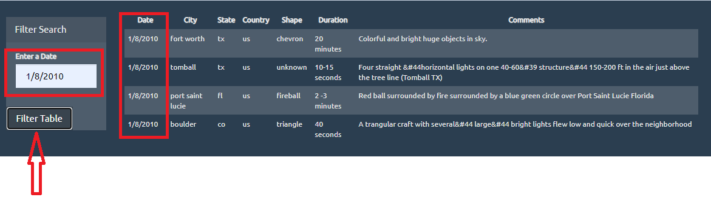
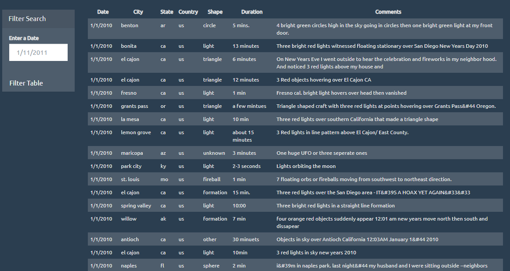

 Inside folder `UFO-level-1` you will find the html, css, and js files created for this project.
 
# Javascript-challenge

### Automatic Table and Date Search

* In this HTML web page, I used a UFO dataset provided in the form of an array of JavaScript objects.
* I wrote code that appended a table to the web page which adds new rows of data for each UFO sighting.

  * Included is a column for `date/time`, `city`, `state`, `country`, `shape`, and `comments`

* I used a date form in your HTML document and wrote JavaScript code that listens for events and searches through the `date/time` column to find rows that matched user input.
* 
* 

